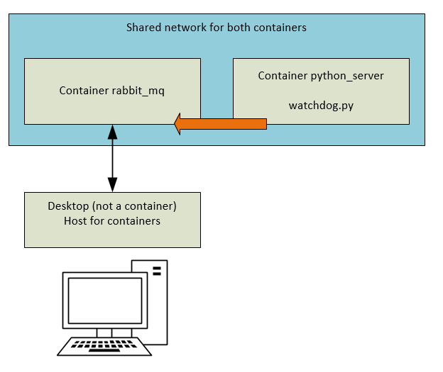

Проект, состоящий из двух приложений: - клиент и сервер. Суть решения - удаленный монитор содержимого каталога.

Сервер получает путь к каталогу через аргументы командной строки. 
Клиенту получает адрес сервера.
Сервер следит за изменениями в заданном каталоге, и, если содержимое изменилось, оно должно быстро обновиться на клиенте.

Решение с использованием amqp.

-------------------------------------------------------------------------------------------------------------------------

Решение использует:
    * python 3.7
    * RabbitMQ

При помощи Докера проект разворачивается на одном компьютере по схеме приведенной на рисунке.
