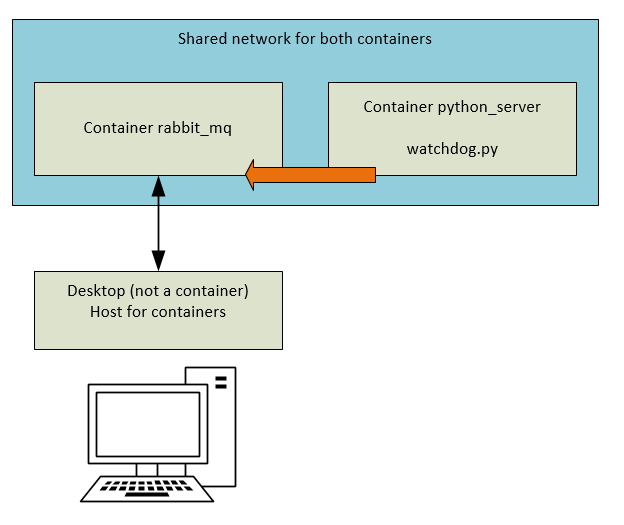

Проект, состоящий из двух приложений: - клиент и сервер. Суть решения - удаленный монитор содержимого каталога.

Сервер получает путь к каталогу через аргументы командной строки. 
Клиенту получает адрес сервера.
Сервер следит за изменениями в заданном каталоге, и, если содержимое изменилось, оно должно быстро обновиться на клиенте.

Решение с использованием amqp.

-------------------------------------------------------------------------------------------------------------------------

Решение использует:

    * python 3.7
    * RabbitMQ

При помощи Докера проект разворачивается на одном компьютере по схеме приведенной на рисунке.

После запуска docker-compose up -d (в папке с файлом .yaml)
разворачивается два контейнера, находящиеся в одной сети. 

Файл watchdog.py, находящийся в сервисе python_serve запускается командой 
python watchdog.py <path_to_follow> <url>. Исходя из настроек в .yaml , url=rabbitmq_1
(можно сделать это автоматически, изменив настройки в .yaml)

На компьютере хосте нужно развернуть приложение read.py (оно пока консольное).

Теперь при любом изменении path_to_follow скрипт watchdog.py будет отправлять сообщения в очередь rabbit_mq, 
а компьютер-хост контейнеров при помощи read.py будет их немедленно получать
